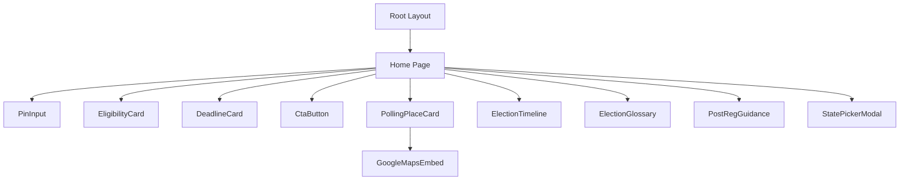
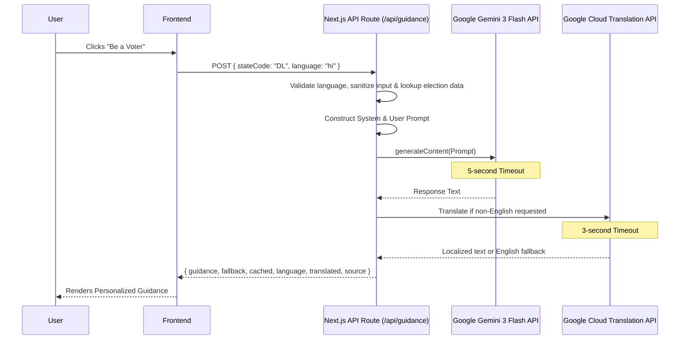

# System Architecture

## Component Hierarchy

## Data Flow (Gemini Post-Registration Guidance)

## Security & Privacy Design
1. **Stateless AI Calls:** We pass the user's State Code to Gemini, not their PIN Code or any Personal Identifiable Information (PII).
2. **Server-Side Masking:** The `GEMINI_API_KEY` is loaded on the server side (`/api/guidance/route.ts`). It is never bundled or leaked to the client.
3. **Graceful Degradation:** If Gemini or Translation times out or fails, predefined English guidance is returned and the UI labels the fallback state.
4. **Analytics Privacy:** Unmapped PIN lookups are tracked as a generic event label, never as raw PIN codes.
