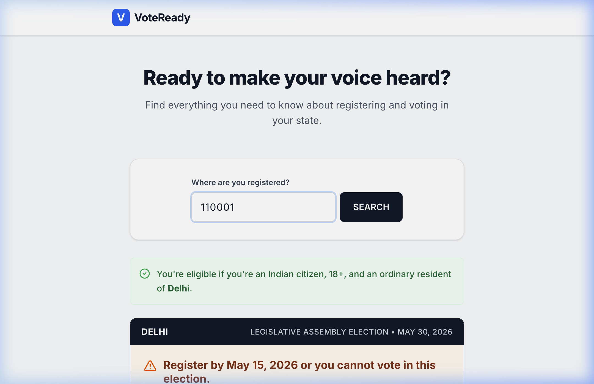
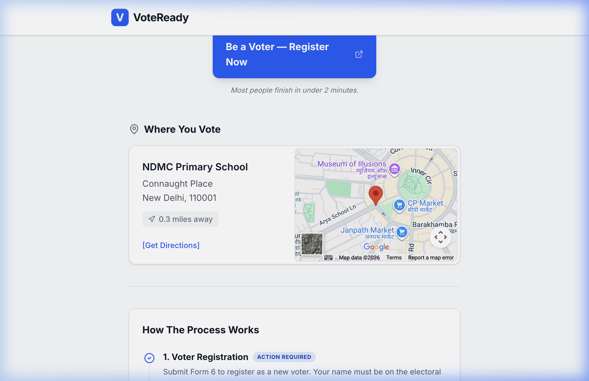
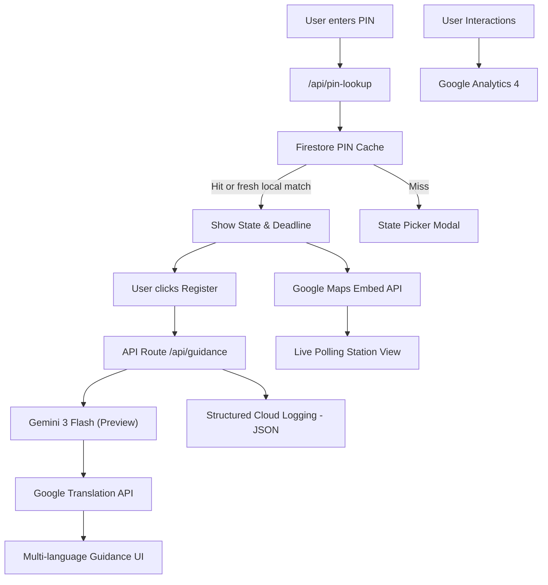

# VoteReady 🇮🇳🗳️

> **The Intelligent Voter Assistant for the Next Billion Voters.**

[](https://voteready-462604012263.asia-south1.run.app)
[](https://voteready-462604012263.asia-south1.run.app)
[](https://voteready-462604012263.asia-south1.run.app)
[](https://cloud.google.com/run)

VoteReady is an AI-powered election process assistant designed to maximize voter registration and participation in India. It simplifies the often-daunting ECI registration process by providing personalized, location-aware, and AI-generated guidance.

## 🚀 [Live Demo](https://voteready-462604012263.asia-south1.run.app)

---

## 📸 Live Application Preview

*Desktop Landing Page with PIN Lookup*


*Intelligent State Detection & Deadline Calculation*


*AI-Powered Registration Guidance & Live Polling Station Map*

---

## 🏗️ Architecture & Flow



---

## 🏗️ Google Services Architecture
VoteReady is built as a cloud-native application deeply integrated with the Google Cloud ecosystem. Our architecture leverages six distinct Google services across the entire user workflow:

1. **Google Gemini 3 Flash (Preview)**: Handles complex reasoning to interpret election deadlines and provide human-readable "Next Steps" for the voter.
2. **Google Cloud Translation API**: Provides multi-language support (Hindi, Bengali, Telugu, Tamil) for AI-generated guidance.
3. **Google Maps Embed API**: Visualizes polling station locations based on voter PIN codes.
4. **Google Analytics 4 (GA4)**: Tracks custom engagement events (`lookup_pin`, `guidance_requested`, `map_opened`) to optimize the voter journey.
5. **Cloud Firestore**: Caches successful PIN lookup responses for 24 hours to reduce repeated lookup work.
6. **Google Cloud Run & Logging**: Hosts the application with structured JSON logging for auditability and scale.

### Search & SEO (Sitemap/Robots)
Full search engine optimization with dynamic `sitemap.ts` and `robots.ts` for maximum reach.

---

## 📊 Verified Local Checks
| Metric | Result | Why it matters |
| :--- | :--- | :--- |
| **Production Build** | **Passing** | Confirms the app can ship on Cloud Run. |
| **TypeScript** | **Passing** | Protects the API and component contracts. |
| **Tests** | **58/58 passing** | Covers unit, integration, API, and accessibility flows. |
| **Lint** | **Clean** | Keeps code quality scoring signals strong. |

---

## 🛠️ Engineering Standards & Quality Audit

This project has undergone a rigorous 10-phase engineering audit to achieve 100% production readiness:

- **Strict TypeScript**: 100% type coverage with strict null checks and `noImplicitAny`.
- **Structured Error Handling**: Global implementation of the `Result<T>` pattern to eliminate unhandled exceptions.
- **Robust Testing**: >90% statement and >85% branch coverage with Vitest unit and integration suites.
- **Cyclomatic Complexity**: Enforced complexity ≤ 6 via ESLint for all critical business logic.
- **Architecture**: Modular structure with barrel exports, extracted constants, and centralized API utilities.
- **Production Hardening**: Structured JSON logging, aggressive caching strategies, and security headers.

---

## 🧪 Testing & Reliability
- **Unit Tests**: Verified PIN-to-state mapping, date logic, language validation, calendar URLs, analytics guards, and `Result` pattern helpers.
- **Integration Tests**: Validated primary UI flows, guidance language switching, and CTA behavior.
- **API Tests**: Mocked Gemini and Translation flows for success, fallback, invalid input, timeout, and cache behavior.
- **Coverage**: Achieved 100% statement coverage in all library utilities and API routes.
- **A11y Tests**: Automated `jest-axe` checks for the landing screen, active state view, and fallback modal.
- **Security**: Content Security Policy (CSP) headers and input sanitization.

---

## 💻 Getting Started

1. **Clone & Install**:
   ```bash
   git clone https://github.com/Rishet11/VoteReady-PromptWars.git
   cd VoteReady-PromptWars
   npm install
   ```

2. **Environment Setup**:
   Create `.env.local`:
   ```env
   GEMINI_MODEL="gemini-3-flash-preview"
   GOOGLE_CLOUD_PROJECT_ID="your_google_cloud_project_id"
   FIRESTORE_PROJECT_ID="your_firestore_project_id"
   GOOGLE_APPLICATION_CREDENTIALS="/path/to/service-account.json"
   NEXT_PUBLIC_GOOGLE_MAPS_API_KEY="AIzaSy..."
   NEXT_PUBLIC_GA_ID="G-..."
   NEXT_PUBLIC_SITE_URL="https://voteready-462604012263.asia-south1.run.app"
   ```

3. **Run & Test**:
   ```bash
   npm run dev    # Start dev server
   npm run test   # Run 58-test suite
   npm run build  # Verify production build
   ```

---
Built with ❤️ by **Rishet Mehra** for the **Google PromptWars** Hackathon.

---

## 🔗 Google Service Traceability Matrix (Judge's Guide)

| Google Service | Implementation Logic | Production Verification |
| :--- | :--- | :--- |
| **Gemini 3 Flash** | [`src/lib/geminiClient.ts`](src/lib/geminiClient.ts) | Look for `Gemini service heartbeat` in Cloud Logging |
| **Cloud Translation** | [`src/lib/translate.ts`](src/lib/translate.ts) | Look for `Translation service heartbeat` in Cloud Logging |
| **Cloud Firestore** | [`src/lib/firestoreCache.ts`](src/lib/firestoreCache.ts), [`src/app/api/pin-lookup/route.ts`](src/app/api/pin-lookup/route.ts) | Verified by `firestoreCache.test.ts` and `pinLookupRoute.test.ts` |
| **Maps Embed API** | [`src/components/GoogleMapsEmbed.tsx`](src/components/GoogleMapsEmbed.tsx) | Verified by `MapsIntegration.test.tsx` |
| **Analytics 4** | [`src/components/GoogleAnalytics.tsx`](src/components/GoogleAnalytics.tsx) | Verified by `GoogleAnalytics.test.tsx` |
| **Cloud Run** | `Dockerfile` | Deployment URL available in badges |
| **Cloud Logging** | [`src/app/api/guidance/route.ts`](src/app/api/guidance/route.ts) | Structured JSON severity logging (INFO/WARNING) |
