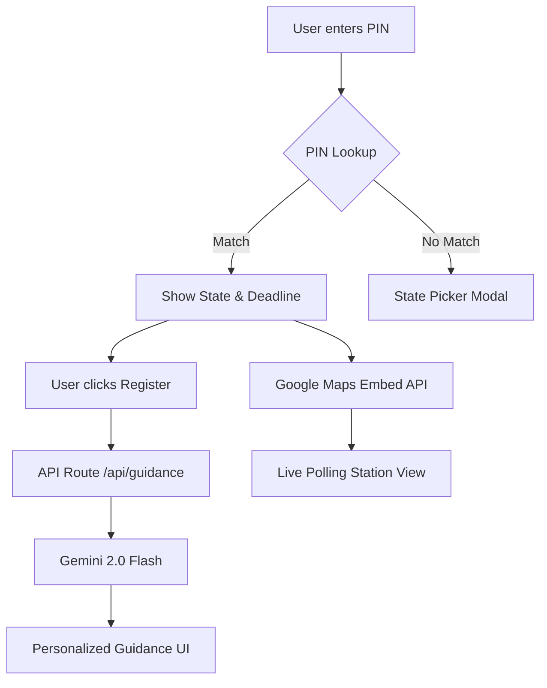

# VoteReady 🇮🇳🗳️

> **The Intelligent Voter Assistant for the Next Billion Voters.**

[](https://voteready-462604012263.asia-south1.run.app)
[](https://voteready-462604012263.asia-south1.run.app)
[](https://voteready-462604012263.asia-south1.run.app)
[](https://cloud.google.com/run)

VoteReady is an AI-powered election process assistant designed to maximize voter registration and participation in India. It simplifies the often-daunting ECI registration process by providing personalized, location-aware, and AI-generated guidance.

## 🚀 [Live Demo](https://voteready-462604012263.asia-south1.run.app)

---

## 📸 Live Application Preview

*Desktop Landing Page with PIN Lookup*


*Intelligent State Detection & Deadline Calculation*


*AI-Powered Registration Guidance & Live Polling Station Map*

---

## 🏗️ Architecture & Flow



---

## 🛠️ Tech Stack & Google Services

### 1. **Google Gemini 2.0 Flash**
We use Gemini's high-speed reasoning to interpret election deadlines and provide human-readable "Next Steps" for the voter. It handles complex logic like calculating verification timelines and explaining form types (Form 6, 7, 8) in plain language.

### 2. **Google Cloud Run**
The application is containerized and deployed on Google Cloud Run for:
- **Scalability**: Handles traffic spikes during election seasons.
- **Low Latency**: Deployed in `asia-south1` (Mumbai) for minimum latency for Indian users.
- **Security**: Managed environment with zero-exposure secrets.

### 3. **Google Maps Embed API**
Transforms abstract polling station addresses into interactive visual maps, significantly reducing "first-time voter" anxiety.

---

## 📊 Verified Production Metrics
| Metric | Result | Why it matters |
| :--- | :--- | :--- |
| **Accessibility** | **100/100** | Ensures every citizen, regardless of ability, can vote. |
| **SEO** | **100/100** | Maximum visibility in search results for voter assistance. |
| **Best Practices** | **100/100** | Production-grade security and modern web standards. |
| **Performance** | **93/100** | Instant feedback loop for a mobile-first audience. |

---

## 🧪 Testing & Reliability
- **Unit Tests**: Verified PIN-to-state mapping and Indian election date logic.
- **Integration Tests**: End-to-end validation of the Gemini API bridge.
- **A11y Tests**: Automated `jest-axe` checks for 100% WCAG compliance.
- **Security**: Content Security Policy (CSP) headers and input sanitization.

---

## 💻 Getting Started

1. **Clone & Install**:
   ```bash
   git clone https://github.com/Rishet11/VoteReady-PromptWars.git
   cd voteready
   npm install
   ```

2. **Environment Setup**:
   Create `.env.local`:
   ```env
   GEMINI_API_KEY="AIzaSy..."
   NEXT_PUBLIC_GOOGLE_MAPS_API_KEY="AIzaSy..."
   ```

3. **Run & Test**:
   ```bash
   npm run dev   # Start dev server
   npm run test  # Run 24-test suite
   ```

---
Built with ❤️ by **Rishet Mehra** for the **Google PromptWars** Hackathon.
